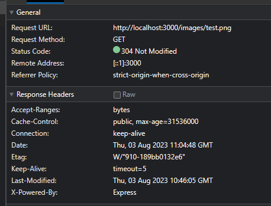

# User Update part 

## User Profile Image

- Now let’s begin the test. Now let’s go back to the `UserUpdate.test.ts` add this line of test. So, in this test we will be sending the our locale tile to the backend .  Please be note, that the test below will shows a typescript error, since we don’t have any image properties in the database module.
    
    ```tsx
    import fs from 'fs';
    import path from 'path';
    
    // the previous code ...
    
    test('saves the user image when update contains image as base64', async () => {
        const filePath = path.join('.', '__tests__', 'resources', 'test-png.png');
        const fileInBase64 = fs.readFileSync(filePath, {encoding: 'base64'});
    
        const userList = await UserHelperModel.addMultipleNewUsers(1, 0);
    
        const validUpdate = { 
          username: 'user1-updated',
          image: fileInBase64,
        };
    
        await putUser(
          userList[0].id, 
          validUpdate, 
          {auth : { 
            email : emailUser1, 
            password: passwordUser1,
          }}
        );
    
        const updatedUser = await UserHelperModel.getActiveUserByid(userList[0].id);
        expect(updatedUser?.image).toBeTruthy();
      });
    ```
    
- Implementation
    - First of all, let’s change the `User Model` schema first. Let’s add it :  ( I just adding the additional code for it )
        
        ```tsx
        declare image: CreationOptional<string>;
        
        // In the `User.init` 
        
        image: DataTypes.STRING,
        ```
        
    - Second now let’s go to the controller, and this time we have to add something to the body validation first. We’d like to add a new field `image` however this is just optional only :  By doing this way, we won’t allow any unknown field.
        
        ```tsx
        export const userUpdateSchema = Joi.object({
          username: Joi.string()
            .required()
            .messages({
              'any.required': Locales.errorUsernameEmpty,
              'string.empty': Locales.errorUsernameEmpty,
              'string.base': Locales.errorUsernameNull,
            }),
          image: Joi.any().optional(),
        }).options({
            allowUnknown: false,
        }).messages({
          'object.unknown': Locales.customFieldNotAllowed,
        });
        ```
        
    - The third, is to update the function both in the controller helper an also in the model helper
        
        In the controller helper  
        
        =⇒ I’m changing the whole structure now, by changing the data type for any in the request body. Eventhough I have already validated it in the middleware but it’s only for the user name, I haven’t validated anything for the image. 
        
        ```tsx
        public static async httpPutUserById(
            req: RequestWithAuthenticatedUser,
            res: Response,
            next: NextFunction
          ): Promise<void> {
            try {
              const authenticatedUser = req.authenticatedUser;
              const requestBody: unknown = req.body;
              const id = Number(req.params.id);
        
              if ( !authenticatedUser || authenticatedUser.id !== id) {
                throw new ErrorAuthForbidden(Locales.unauthorizedUserUpdate);
              }
        
              if (typeof requestBody !== 'object' || requestBody === null) {
                throw new Error('Something wrong with the req.body, please check the middleware');
              }
        
              const expectedRequestBody = requestBody as ExpectedRequestBodyhttpPutUserById;
        
              await UserHelperModel.updateUserByID(id, expectedRequestBody );
              res.send();
            }
        
            catch(err) {
              next(err);
            }
          }
        
        ```
        
        Now in the model helper 
        
        ⇒ Basically this is quite the same with previously, the only difference is for the checking whether the image properties exist or not, if yes, then I’ll assign value to it. 
        
        ```tsx
        public static async updateUserByID(idParams: number, body: ExpectedRequestBodyhttpPutUserById): Promise<void> {
            const user = await this.getActiveUserByid(idParams);
        
            if (!user) {
              throw new ErrorUserNotFound();
            }
        
            if (body.image) {
              user.image = body.image;
            }
        
            user.username = body.username;
        
            await user.save();
          }
        ```
        

## Image in Responses

In our previous responses we don't send anything about the image. If we change the implementation then we're going to broker our tests. 

Now let's add the `image` properties in the `user.helper.model.ts` in the :
- `getAllActiveUser`
- `getActiveUserByIDReturnIdUserImageOnly`

Now let's modify it to return the image also. Now we will have two tests fail in the `UserListing.test.ts`

Let's modify the test to also check for the `image` properties. 

Now let's move to the `auth.helper.controller` and update the implementation to send also the image. Remember in this case we also need to update the implementation for passport local auth to also put the image in the `req.user`. 

Now let's create a new test for this : 

```
test('returns success body having only id, username, email and image', async() => {
  const filePath = path.join('.', 'src', '__tests__', 'resources', 'test-png.png');
  const fileInBase64 = fs.readFileSync(filePath, {encoding: 'base64'});

  const userList = await UserHelperModel.addMultipleNewUsers(1, 0);
  
  const validUpdate = { 
    username: 'user1-updated',
    image: fileInBase64,
  };
  
  const response = await putUser(
    userList[0].id, 
    validUpdate, 
    {auth : { 
      email : emailUser1, 
      password: passwordUser1,
    }}
  );
  
  expect(Object.keys(response.body)).toEqual(['id', 'username', 'email', 'image']);
});
```

This will fail since we didn't sent anything. 
Now let' fix our implementation: 
`updateUserByID`: 
```
public static async updateUserByID(
  idParams: number, 
  body: ExpectedRequestBodyhttpPutUserById
): Promise<UserDataFromDB> {
  const user = await this.getActiveUserByID(idParams);

  if (!user) {
    throw new ErrorUserNotFound();
  }

  if (body.image) {
    user.image = body.image;
  }

  user.username = body.username;

  await user.save();

  return {
    id: user.id,
    username: user.username,
    email: user.email,
    image: user.image,
  };
  }
```

then in the controller helper : `user.helper.controller.ts`: 

```
public static async httpPutUserById(
  req: RequestWithAuthenticatedUser,
  res: Response,
  next: NextFunction
): Promise<void> {
  try {
    const authenticatedUser = req.authenticatedUser;
    const requestBody: unknown = req.body;
    const id = Number(req.params.id);

    if ( !authenticatedUser || authenticatedUser.id !== id) {
      throw new ErrorAuthForbidden(Locales.unauthorizedUserUpdate);
    }

    if (typeof requestBody !== 'object' || requestBody === null) {
      throw new Error('Something wrong with the req.body, please check the middleware');
    }

    const expectedRequestBody = requestBody as ExpectedRequestBodyhttpPutUserById;

    const userDataFromDB = await UserHelperModel.updateUserByID(id, expectedRequestBody );
    res.send(userDataFromDB);
  }

  catch(err) {
    next(err);
  }
}
```

However, for somehow, when I uploaded JPG file format, the application is broken and the request body is empty {}. Now sure why. 

The reason I believe from the front end. 

## Upload Folder

Instead of saving file in a database, let's store it in a local folder. Now let's create: 
- A new test file named: `FileService.test.ts`
- A new util file under `utils` folder, we create a new folder named `File.util.ts`

Now let's create our first test: 
```
import fs from 'fs';
import { FileUtils } from '../utils/file/File.util';


describe('createFolders' , () => {
  test('creates upload folder', () => {
    FileUtils.createFolders();
    const folderName = 'upload';
    expect(fs.existsSync(folderName)).toBe(true);

  });
});
```

The implementation is pretty straightforward, so we're using `fs` module to create a folder: 

```
import fs from 'fs';

export class FileUtils {
  public static createFolders() {
    const  uploadDir = 'upload';

    if (!fs.existsSync(uploadDir)) {
      fs.mkdirSync('upload');
    }
  }
}
```

Then the test will pass.

Now let's create a folder based on the environment. First we have to set the environment variable : `uploadDir`:
```
// in .env.development 

uploadDir=uploads-test

// in .env.test

uploadDir=uploads-dev

```

Now let's update the test: 

```
import dotenv from 'dotenv';
dotenv.config({path: `.env.${process.env.NODE_ENV}`});
import fs from 'fs';
import path from 'path';
import { FileUtils } from '../utils/file/File.util';

const uploadDir = process.env.uploadDir;

const profileDir = 'profile';


if (!uploadDir) {
  throw new Error('Please set up the uploadDir environment');
}

describe('createFolders' , () => {
  test('creates upload folder', () => {
    FileUtils.createFolders();
    const folderName = uploadDir;
    expect(fs.existsSync(folderName)).toBe(true);

  });

  test('creates profile folder under upload folder', () => {
    FileUtils.createFolders();
    const profileFolder = path.join('.', uploadDir, profileDir);
    expect(fs.existsSync(profileFolder)).toBe(true);
  });
});
```

And here's the implementation: 

```
import dotenv from 'dotenv';
dotenv.config({path: `.env.${process.env.NODE_ENV}`});
import fs from 'fs';
import path from 'path';

const profileDir = 'profile';

export class FileUtils {
  public static createFolders() {

    const uploadDir = process.env.uploadDir;

    if (!uploadDir) {
      throw new Error('Please set up the uploadDir environment');
    }

    if (!fs.existsSync(uploadDir)) {
      fs.mkdirSync(uploadDir);
    }

    const profileFolder = path.join('.', uploadDir, profileDir);

    if (!fs.existsSync(profileFolder)) {
      fs.mkdirSync(profileFolder);
    }
  }
}
```

Great now let's call this function in our `app.ts` so it will run when we run the server. 
So, I'm adding a new static function and run in `this.runFileUtils();`


## Storing Images locally

Ok now let's create a test for it. So, instead of saving the image file in the database, we're going to save the file in the local folder: 

```
  test('saves the user image to upload folder and stores filename in user when update has image', async () => {
    const fileInBase64 = readFileAsBase64();

    const userList = await UserHelperModel.addMultipleNewUsers(1, 0);
    
    const validUpdate = { 
      username: 'user1-updated',
      image: fileInBase64,
    };
    
    await putUser(
      userList[0].id, 
      validUpdate, 
      {auth : { 
        email : emailUser1, 
        password: passwordUser1,
      }}
    );
      
    const updatedUser = await UserHelperModel.getActiveUserByID(userList[0].id);

    if (!updatedUser?.image) {
      throw new Error('Please ensure there\'s an image file in this test');
    }

    const profileImagePath = path.join(profileDirectory, updatedUser.image );

    expect(fs.existsSync(profileImagePath)).toBe(true);
    
  });
```

The test above checks whether we have a certain file exist in our local file. 

And here's the implementation: 

In the `updateUserByID`, we're calling a function in a `File.util` to save the profile image like this : 
```
  public static async updateUserByID(
    idParams: number, 
    body: ExpectedRequestBodyhttpPutUserById
  ): Promise<UserDataFromDB> {
    const user = await this.getActiveUserByID(idParams);

    if (!user) {
      throw new ErrorUserNotFound();
    }

    if (body.image) {
      const fileName = await FileUtils.saveProfileImage(body.image);
      user.image = fileName;
    }

    user.username = body.username;

    await user.save();

    return {
      id: user.id,
      username: user.username,
      email: user.email,
      image: user.image,
    };
  }
```

Now let's write the `saveProfileImage` function like this : 
```
  import dotenv from 'dotenv';
  dotenv.config({path: `.env.${process.env.NODE_ENV}`});
  import fs from 'fs';
  import path from 'path';

  import { AuthHelperModel } from '../../models';

  if (!process.env.uploadDir) {
    throw new Error('Please set up the uploadDir environment');
  }

  const uploadDir = process.env.uploadDir;
  const profileDir = 'profile';
  const profileFolder = path.join('.', uploadDir, profileDir);


  export class FileUtils {
    public static createFolders() {

      if (!fs.existsSync(uploadDir)) {
        fs.mkdirSync(uploadDir);
      }

      if (!fs.existsSync(profileFolder)) {
        fs.mkdirSync(profileFolder);
      }
    }

    public static async saveProfileImage(base64File: string) {

      const fileName = AuthHelperModel.randomString(32);

      const filePath = path.join(profileFolder, fileName);

      await fs.promises.writeFile(filePath, base64File, 'base64');

      return fileName;
    }
  }
```

Perfect, now we can save the file directly in the local directory. 


## Serving Static Resources

This time we will create a feature for our app to server static files. 

Let's create the test first: 

```
import dotenv from 'dotenv';
dotenv.config({path: `.env.${process.env.NODE_ENV}`});
import fs from 'fs';
import path from 'path';
import request from 'supertest';
import { app } from '../app';

const uploadDir = process.env.uploadDir;

const profileDir = 'profile';

if (!uploadDir) {
  throw new Error('Please set up the uploadDir environment');
}

const profileDirectory = path.join('.', uploadDir, profileDir);

describe('Profile Images', () => {
  test('returns 404 when file not found', async() => {
    const response = await request(app).get('/images/123456');
    expect(response.status).toBe(404);
  });

  test('returns 200 when file exists', async() => {
    const filePath = path.join('.', 'src', '__tests__', 'resources', 'test-png.png');
    const storedFileName = 'test-file';
    const targetPath = path.join(profileDirectory, storedFileName);
    fs.copyFileSync(filePath, targetPath);
    const response = await request(app).get(`/images/${storedFileName}`);
    expect(response.status).toBe(200);
  });
});
```

Ok! The test above is our initial test. As you can see that we're requesting a get request with the url is `images`. 

For the implementation is very simple. First we create a new function under `startupMiddleware` in the `app.ts`:

```
private static configStaticFiles(): void {
  if (!process.env.uploadDir) {
    throw new Error('Please set up the uploadDir environment');
  }
  
  const uploadDir = process.env.uploadDir;
  const profileDir = 'profile';
  const profileFolder = path.join('.', uploadDir, profileDir);

  app.use('/images', express.static(profileFolder));
  }
```

As you can see, that we're configuring our app to server the static file if the path of the get request is `/images`. 

Then we can call this function within `configMiddleware` function. 

If we run our server, we can access the image through this link like this : 
`http://localhost:3000/images/test.png`

Now let's add more functionality. Let's use client's side caching. Ever time the browser refresh it'll ask backend whether there's a change or not, if not then it continues to use the same file it cached. 

Let's set our test:
```
test('returns cached for 1 year in response', async() => {
  const response = await copyFileAndSendRequest();
  const oneYearInSeconds = 365 * 24 * 60 * 60;
  expect(response.header['cache-control']).toContain(`max-age=${oneYearInSeconds}`);
});
```

Now in the implementation we only need to add some option: 

```
const ONE_YEAR_IN_MS = 365 * 24 * 60 * 60 * 1000;
app.use('/images', express.static(profileFolder, {maxAge: ONE_YEAR_IN_MS}));
```

The test then will pass. If we check in the browser it shows like this: 


It shows `304` not modified response if we tried to refresh the browser. The file size is smaller than before. 

## Cleaning Up the Folders

Let's create a clean up test separated from our test file. 
First let's code in the `afterAll` function within `UserUpdate.test.ts`, and move it to a separate file named `test-cleanup.ts`: 
```
import dotenv from 'dotenv';
dotenv.config({path: `.env.${process.env.NODE_ENV}`});
import fs from 'fs';
import path from 'path';

const uploadDir = process.env.uploadDir;

const profileDir = 'profile';

if (!uploadDir) {
  throw new Error('Please set up the uploadDir environment');
}

const profileDirectory = path.join('.', uploadDir, profileDir);


const files = fs.readdirSync(profileDirectory);

for (const file of files){
  fs.unlinkSync(path.join(profileDirectory, file));
}

```

Now in the package.json we're adding the script like this : 

```
  "test": "NODE_ENV=test jest --runInBand --watchAll",
  "posttest": "NODE_ENV=test ts-node src/test-cleanup.ts",
```

If we stop the test, then the script `posttest` will run automatically and clean up all of our folder 
## Replacing Old Image

## Username Validation

## File Size Validation

## File Type Validation


